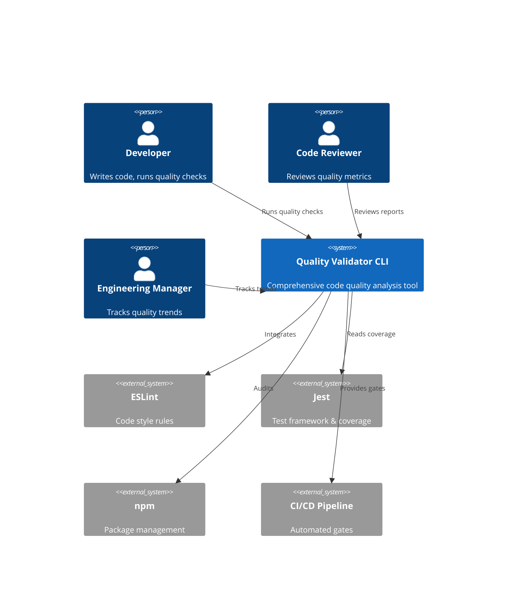
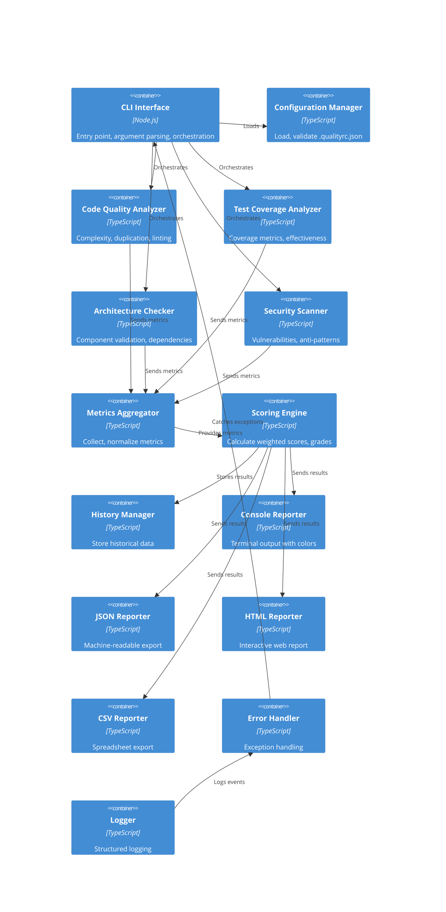

# Quality Validation CLI Tool - Comprehensive System Architecture

**Document ID:** QUAL-ARCH-001
**Version:** 2.0
**Date:** January 20, 2025
**Status:** APPROVED FOR DEVELOPMENT
**Target Audience:** Development Team, System Architects, DevOps Engineers

---

## Executive Summary

This document defines the complete production-ready system architecture for the Quality Validation CLI Tool—a comprehensive utility designed to validate code quality across four critical dimensions:

1. **Code Quality** - Cyclomatic complexity, code duplication, code style
2. **Test Coverage** - Coverage metrics and test effectiveness scoring
3. **Architecture Compliance** - Component organization and design patterns
4. **Security** - Vulnerability scanning and anti-pattern detection

The architecture emphasizes modularity, extensibility, performance, and reliability for a team of 2-3 developers implementing over 7-8 weeks.

---

## Table of Contents

1. [System Context and Boundaries](#1-system-context-and-boundaries)
2. [High-Level Architecture](#2-high-level-architecture)
3. [Component Design](#3-component-design)
4. [Data Architecture](#4-data-architecture)
5. [Technology Stack](#5-technology-stack)
6. [Configuration System](#6-configuration-system)
7. [Error Handling Strategy](#7-error-handling-strategy)
8. [Performance Considerations](#8-performance-considerations)
9. [Security Architecture](#9-security-architecture)
10. [Testing Strategy](#10-testing-strategy)
11. [API Specifications](#11-api-specifications)
12. [Deployment Architecture](#12-deployment-architecture)

---

## 1. System Context and Boundaries

### 1.1 System Context Diagram



### 1.2 What the System Does

- **Analyzes** code quality across 4 dimensions independently and in parallel
- **Aggregates** metrics from multiple sources into unified metrics
- **Scores** code quality with weighted algorithm producing letter grade
- **Reports** results in multiple formats (console, JSON, HTML, CSV)
- **Stores** historical data to track trends over time
- **Integrates** with npm scripts and CI/CD pipelines

### 1.3 System Boundaries

**In Scope (MVP):**
- TypeScript/TSX files in `src/` directory
- Code complexity, duplication, and style analysis
- Test coverage metrics and effectiveness scoring
- Component architecture validation
- Security vulnerability and anti-pattern detection
- 4 report formats (console, JSON, HTML, CSV)
- Configuration via `.qualityrc.json`
- Historical trend tracking

**Out of Scope:**
- Test execution (uses existing Jest coverage data)
- Modifying ESLint/Jest configuration
- IDE plugins or integrations
- Runtime performance profiling
- Automatic code fixing
- Backend/Node.js code analysis

---

## 2. High-Level Architecture

### 2.1 Container Diagram



---

## 3. Component Design

### 3.1 CLI Interface & Command Handler

**Location:** `src/cli/index.ts`
**Purpose:** Entry point, command parsing, workflow orchestration
**Technology:** Commander.js or yargs, Node.js APIs

#### 3.1.1 Responsibilities

1. Parse command-line arguments
2. Load configuration
3. Orchestrate analyzer execution (parallel)
4. Aggregate results
5. Generate reports based on format flag
6. Return appropriate exit codes

#### 3.1.2 Command Structure

```bash
npm run quality:check                    # Full analysis, console output
npm run quality:check --format json      # JSON output to stdout
npm run quality:check --format html      # HTML output
npm run quality:check --output file.json # Write to file
npm run quality:check --verbose          # Detailed logging
npm run quality:check --help             # Display help
```

#### 3.1.3 Exit Codes

- `0` - Success, all thresholds met
- `1` - Failure, quality issues detected
- `2` - Configuration error
- `3` - Execution error (missing files, permissions)

#### 3.1.4 Orchestration Flow

```typescript
async function main(args: string[]) {
  try {
    // 1. Parse arguments
    const options = parseArguments(args);

    // 2. Load configuration
    const config = await loadConfiguration(options.config);

    // 3. Run analyzers in parallel
    const [cq, tc, arch, sec] = await Promise.all([
      analyzeCodeQuality(config),
      analyzeTestCoverage(config),
      checkArchitecture(config),
      scanSecurity(config)
    ]);

    // 4. Aggregate metrics
    const metrics = aggregator.aggregate([cq, tc, arch, sec]);

    // 5. Calculate score
    const score = scorer.calculate(metrics, config.scoring);

    // 6. Store history
    history.save(score);

    // 7. Generate reports
    await generateReports(score, options);

    // 8. Exit with appropriate code
    process.exit(score.status === 'pass' ? 0 : 1);
  } catch (error) {
    errorHandler.handle(error);
    process.exit(getExitCode(error));
  }
}
```

### 3.2 Code Quality Analyzer

**Location:** `src/lib/analyzers/code-quality/`
**Purpose:** Analyze complexity, duplication, style
**Technologies:** TypeScript compiler API, jscpd, ESLint API

#### 3.2.1 Cyclomatic Complexity Module

**Algorithm:** Count decision points in AST

```typescript
interface ComplexityMetrics {
  functionName: string;
  file: string;
  line: number;
  complexity: number;
  threshold: number;
  status: 'good' | 'warning' | 'critical';
}

// Calculation: Start at 1, increment for each:
// - if statement
// - else/else-if
// - switch/case
// - while/for/do-while loop
// - catch clause
// - logical && and ||
// - ternary ? :

function calculateCC(node: FunctionNode): number {
  let cc = 1;
  // Walk AST and count decision points
  return cc;
}
```

**Thresholds:**
- Green: CC ≤ 10
- Yellow: 11 ≤ CC ≤ 20
- Red: CC > 20

**Output Metrics:**
- Functions exceeding threshold (critical, warning)
- Average CC per file
- Maximum CC in codebase
- Distribution histogram

#### 3.2.2 Code Duplication Module

**Algorithm:** Block comparison with hashing

```typescript
interface DuplicationBlock {
  lines: string[];
  size: number;
  locations: Array<{ file: string; startLine: number; endLine: number }>;
  percentage: number;
}

function detectDuplication(files: SourceFile[]): DuplicationReport {
  // 1. Extract 4+ line blocks
  // 2. Normalize whitespace/comments
  // 3. Hash blocks
  // 4. Find duplicate hashes
  // 5. Merge adjacent duplicates
  // 6. Calculate percentage
}
```

**Thresholds:**
- Green: < 3%
- Yellow: 3-5%
- Red: > 5%

**Configuration:**
- Minimum block size: 4 lines
- Match tolerance: 95%+ similarity
- Exclude: test files, node_modules, generated files

#### 3.2.3 Code Style Module

**Integration:** ESLint programmatic API

```typescript
interface LintingViolation {
  file: string;
  line: number;
  column: number;
  severity: 'error' | 'warning' | 'info';
  rule: string;
  message: string;
  fixable: boolean;
}

function analyzeLinting(): LintingReport {
  // Use ESLint API with project config
  // Report violations grouped by rule/severity
  // Separate fixable violations
}
```

**Thresholds:**
- Green: 0 errors AND ≤ 5 warnings
- Yellow: 1-3 errors OR 6-15 warnings
- Red: > 3 errors OR > 15 warnings

### 3.3 Test Coverage Analyzer

**Location:** `src/lib/analyzers/test-coverage/`
**Purpose:** Analyze test coverage and effectiveness
**Technologies:** Jest coverage parser, AST analysis

#### 3.3.1 Coverage Metrics Module

**Data Source:** Jest `coverage-final.json`

```typescript
interface CoverageMetrics {
  overall: {
    lines: { total: number; covered: number; percentage: number };
    branches: { total: number; covered: number; percentage: number };
    functions: { total: number; covered: number; percentage: number };
    statements: { total: number; covered: number; percentage: number };
  };
  byFile: Record<string, FileCoverage>;
  gaps: CoverageGap[];
}

function parseCoverageData(jestCoveragePath: string): CoverageMetrics {
  // Read coverage-final.json
  // Aggregate metrics by type
  // Identify uncovered lines/branches
  // Prioritize gaps by impact
}
```

**Thresholds:**
- Green: All ≥ 80%
- Yellow: 60-79%
- Red: < 60%

#### 3.3.2 Test Effectiveness Module

**Evaluation Criteria:**

```typescript
interface TestEffectiveness {
  totalTests: number;
  testsWithNames: number;
  averageAssertionsPerTest: number;
  testsWithoutAssertions: number;
  excessiveMockUsage: number;
  isolationScore: number;
  effectivenessScore: number; // 0-100
}

function analyzeEffectiveness(): TestEffectiveness {
  // 1. Count test files and cases
  // 2. Check naming conventions
  // 3. Count assertions per test
  // 4. Detect excessive mocking
  // 5. Check test isolation
  // 6. Calculate composite score
}
```

**Scoring Formula:**

```
score = (
  (namedTestsPercent * 0.25) +
  (assertionDensityScore * 0.25) +
  (appropriateMockUsage * 0.20) +
  (testIsolationScore * 0.20) +
  (coveragePercent * 0.10)
) * 100
```

#### 3.3.3 Coverage Gap Analyzer

**Prioritization:**

```typescript
interface CoverageGap {
  file: string;
  coverage: number;
  uncoveredLines: number;
  criticality: 'critical' | 'high' | 'medium' | 'low';
  suggestedTests: string[];
  estimatedEffort: 'high' | 'medium' | 'low';
}

function analyzeCoverageGaps(): CoverageGap[] {
  // Identify uncovered files
  // Prioritize by complexity + size
  // Estimate test effort
  // Suggest specific tests
}
```

### 3.4 Architecture Compliance Checker

**Location:** `src/lib/analyzers/architecture/`
**Purpose:** Validate component organization, dependencies, patterns
**Technologies:** AST analysis, file system traversal

#### 3.4.1 Component Architecture Module

**Atomic Design Classification:**

```
src/components/
├── atoms/       - Basic elements (Button, Badge, Icon)
├── molecules/   - Simple combinations (Form, Card)
├── organisms/   - Complex combinations (Modal, Navbar)
└── templates/   - Page layouts (Dashboard, Profile)
```

**Validation:**

```typescript
interface ComponentAnalysis {
  file: string;
  componentName: string;
  actualType: string;     // from folder structure
  expectedType: string;   // based on naming
  size: number;           // lines of code
  sizeStatus: 'good' | 'warning' | 'critical';
  props: PropInfo[];
  dependencies: string[];
  violations: Violation[];
}

function validateComponents(): ComponentReport {
  // 1. Scan component files
  // 2. Extract from folder structure
  // 3. Measure file size
  // 4. Parse props and dependencies
  // 5. Check size thresholds
  // 6. Validate hierarchy
}
```

**Thresholds:**
- Green: < 300 LOC
- Yellow: 300-500 LOC
- Red: > 500 LOC

#### 3.4.2 Dependency Analysis Module

**Algorithm:** Build dependency graph, detect cycles

```typescript
interface DependencyAnalysis {
  totalModules: number;
  circularDependencies: CircularPath[];
  layerViolations: LayerViolation[];
  externalDependencies: Map<string, number>;
}

interface CircularPath {
  path: string[];     // Full cycle path
  severity: 'critical' | 'high';
}

function analyzeDependencies(): DependencyAnalysis {
  // 1. Parse all import statements
  // 2. Build directed graph
  // 3. Perform cycle detection (DFS)
  // 4. Check layer violations
  // 5. Count external dependencies
}
```

**Forbidden Patterns:**
- Components importing from `/store`
- Utilities importing from components
- Non-leaf modules importing from leaves

#### 3.4.3 Redux Pattern Validator

**Validations:**

```typescript
function validateReduxPatterns(): ReduxAnalysis {
  // Check slice organization
  // Verify reducer purity (no mutations)
  // Validate selector patterns
  // Check middleware usage
  // Detect anti-patterns
}
```

**Anti-Patterns Detected:**
- Direct state mutations
- Side effects in reducers
- API calls in reducers
- Non-memoized selectors
- Missing TypeScript typing

#### 3.4.4 React Hooks Validator

**Validations:**

```typescript
function validateHookUsage(): HooksAnalysis {
  // Check hooks at top level only
  // Validate dependency arrays
  // Verify custom hook naming
  // Check for closure issues
}
```

**Rules:**
- Hooks only at component top level
- Complete dependency arrays
- Proper cleanup in dependencies
- Custom hooks start with "use"

### 3.5 Security & Vulnerability Scanner

**Location:** `src/lib/analyzers/security/`
**Purpose:** Detect vulnerabilities and anti-patterns
**Technologies:** npm audit, regex patterns, AST analysis

#### 3.5.1 Dependency Vulnerability Module

**Process:**

```typescript
async function scanVulnerabilities(): Promise<VulnerabilityReport> {
  // 1. Execute: npm audit --json
  // 2. Parse output
  // 3. Classify by severity
  // 4. Suggest fixes
  // 5. Return findings
}

interface Vulnerability {
  package: string;
  currentVersion: string;
  vulnerabilityType: string;
  severity: 'critical' | 'high' | 'medium' | 'low';
  description: string;
  fixedInVersion: string;
}
```

**Severity Mapping:**
- Critical: Security must fix
- High: Security issue, fix soon
- Medium: Potential security issue
- Low: Non-critical issue

#### 3.5.2 Code Pattern Detection Module

**Hard-Coded Secrets:**

```typescript
function detectSecrets(): SecretFinding[] {
  // Flag variables with: "password", "secret", "token", "apiKey"
  // Flag comments with sensitive keywords
  // Flag suspicious numeric literals (> 1000)
  // Flag hard-coded strings matching secret patterns
}
```

**Unsafe DOM Manipulation:**

```typescript
function detectDomPatterns(): DomFinding[] {
  // Flag: dangerouslySetInnerHTML usage
  // Flag: innerHTML assignments
  // Flag: eval() calls
  // Flag: unescaped user input in JSX
}
```

**Missing Input Validation:**

```typescript
function detectValidationGaps(): ValidationFinding[] {
  // Track user input sources
  // Find usage without validation
  // Flag unvalidated form submissions
  // Suggest validation approach
}
```

**XSS Vulnerabilities:**

```typescript
function detectXssRisks(): XssFinding[] {
  // Find unescaped output
  // Detect user input usage
  // Flag unsafe library functions
  // Suggest safe alternatives
}
```

#### 3.5.3 Performance Anti-Patterns Module

**Unnecessary Re-renders:**

```typescript
function detectRenderPatterns(): RenderFinding[] {
  // Flag: inline function definitions in JSX
  // Flag: missing React.memo for expensive children
  // Flag: missing useCallback for callbacks
  // Flag: inline object/array literals
}
```

**Key Usage:**

```typescript
function detectKeyIssues(): KeyFinding[] {
  // Flag: missing keys in lists
  // Flag: using array index as key
  // Flag: non-stable keys
}
```

**Bundle Optimization:**

```typescript
function detectBundleIssues(): BundleFinding[] {
  // Flag: large default imports
  // Flag: missing tree-shaking patterns
  // Flag: unused imports
  // Suggest code splitting
}
```

### 3.6 Scoring Engine

**Location:** `src/lib/scoring/`
**Purpose:** Calculate weighted scores and assign grades
**Technology:** Custom scoring algorithm

#### 3.6.1 Metric Normalization

Convert all metrics to 0-100 scale:

```typescript
function normalizeMetric(value: number, min: number, max: number): number {
  // Clamp to range [0, 100]
  const normalized = ((value - min) / (max - min)) * 100;
  return Math.max(0, Math.min(100, normalized));
}
```

**Category Calculations:**

```typescript
// Code Quality (30% weight)
codeQualityScore = (
  (100 - complexityAboveThreshold) * 0.40 +
  (100 - duplicationAboveThreshold) * 0.35 +
  (lintingPassPercent) * 0.25
)

// Test Coverage (35% weight)
testCoverageScore = (
  (averageCoverage) * 0.60 +
  (effectivenessScore) * 0.40
)

// Architecture (20% weight)
architectureScore = (
  (100 - layerViolationPercent) * 0.40 +
  (100 - circularDepPercent) * 0.30 +
  (componentOrgScore) * 0.30
)

// Security (15% weight)
securityScore = (
  (100 - vulnSeverityScore) * 0.50 +
  (100 - antiPatternScore) * 0.30 +
  (100 - perfIssueScore) * 0.20
)
```

#### 3.6.2 Overall Score Calculation

```typescript
overallScore = (
  (codeQualityScore * 0.30) +
  (testCoverageScore * 0.35) +
  (architectureScore * 0.20) +
  (securityScore * 0.15)
)
```

#### 3.6.3 Grade Assignment

```typescript
function assignGrade(score: number): Grade {
  if (score >= 90) return { grade: 'A', description: 'Excellent' };
  if (score >= 80) return { grade: 'B', description: 'Good' };
  if (score >= 70) return { grade: 'C', description: 'Acceptable' };
  if (score >= 60) return { grade: 'D', description: 'Poor' };
  return { grade: 'F', description: 'Failing' };
}
```

**Color Coding:**
- A/B: Green (Passing)
- C/D: Yellow (Warning)
- F: Red (Failing)

#### 3.6.4 Trend Analysis

```typescript
interface TrendMetrics {
  currentScore: number;
  previousScore: number;
  changePercent: number;
  direction: 'improving' | 'stable' | 'degrading';
  lastFiveScores: number[];
}

function calculateTrend(current: Score, previous: Score | null): TrendMetrics {
  // Compare current with previous
  // Calculate percent change
  // Determine direction
  // Load historical data
}
```

### 3.7 Report Generators

**Location:** `src/lib/reporters/`
**Purpose:** Format and output results

#### 3.7.1 Console Reporter

**Features:**
- Color-coded status (green/yellow/red)
- Grouped findings by severity
- Specific file:line references
- Actionable remediation steps
- Performance metrics

**Sample Output:**

```
╔═══════════════════════════════════════════════════╗
║    QUALITY VALIDATION REPORT - snippet-pastebin   ║
║           2025-01-20 14:32:15 UTC                ║
╚═══════════════════════════════════════════════════╝

┌─ OVERALL ──────────────────────────────────────┐
│ Grade: A (85.3%)                               │
│ Status: ✓ PASSING                              │
│ Trend: ↑ Improving (+2.5% from last run)       │
└────────────────────────────────────────────────┘

[Detailed sections for each category...]

┌─ TOP IMPROVEMENTS ─────────────────────────────┐
│ 1. Fix complexity in 3 functions (~2 hours)    │
│ 2. Add tests for error handling (~4 hours)     │
│ 3. Resolve circular dependencies (~1 hour)     │
└────────────────────────────────────────────────┘

Analysis completed in 8.2 seconds
```

#### 3.7.2 JSON Reporter

**Schema:**

```json
{
  "metadata": {
    "timestamp": "2025-01-20T14:32:15.000Z",
    "toolVersion": "1.0.0",
    "analysisTime": 8.2
  },
  "overall": {
    "grade": "A",
    "score": 85.3,
    "status": "pass"
  },
  "categories": {
    "codeQuality": { "score": 88, "metrics": {...} },
    "testCoverage": { "score": 92, "metrics": {...} },
    "architecture": { "score": 92, "metrics": {...} },
    "security": { "score": 85, "metrics": {...} }
  },
  "findings": [
    {
      "severity": "high",
      "category": "codeQuality",
      "title": "High Cyclomatic Complexity",
      "file": "src/components/Modal.tsx",
      "line": 45,
      "remediation": "Extract to separate functions"
    }
  ],
  "recommendations": [...]
}
```

#### 3.7.3 HTML Reporter

**Features:**
- Standalone single-file with embedded CSS/JS
- Responsive design (mobile/tablet/desktop)
- Interactive sections with drill-down
- Visual charts (complexity distribution, coverage pie)
- Comparison with previous runs
- Professional styling

**Structure:**
- Header: Project name, timestamp, overall grade
- Summary: Score, grade, status, trend
- Categories: Detailed metrics for each dimension
- Findings: Grouped by severity with remediation
- Trends: Historical comparison charts
- Recommendations: Priority-ordered improvements

#### 3.7.4 CSV Reporter

**Format:**

```csv
Category,Metric,Value,Threshold,Status,File,Remediation
Code Quality,Complexity,22,15,FAIL,src/components/Modal.tsx,Extract to separate functions
Test Coverage,Line Coverage,84%,80%,PASS,project-wide,N/A
Architecture,Circular Dependencies,2,0,FAIL,Modal↔FormField,Reorganize imports
```

### 3.8 History Manager

**Location:** `src/lib/history/`
**Purpose:** Store and retrieve historical data
**Storage:** `.quality/history.json`

```typescript
interface HistoricalRun {
  timestamp: string;
  score: number;
  grade: string;
  componentScores: {
    codeQuality: number;
    testCoverage: number;
    architecture: number;
    security: number;
  };
}

function saveRun(score: ScoringResult): void {
  // Load existing history
  // Add current run
  // Keep only last 10 runs
  // Save back to file
}

function calculateTrend(current: Score): TrendData {
  // Load previous run
  // Calculate percent change
  // Determine direction
  // Return trend
}
```

---

## 4. Data Architecture

### 4.1 Data Flow

```
Source Files
    ↓
[Parse & Filter]
    ↓
[Parallel Analysis]
├─→ Code Quality
├─→ Test Coverage
├─→ Architecture
└─→ Security
    ↓
[Aggregation]
    ↓
[Scoring]
    ↓
[History Storage]
    ↓
[Report Generation]
    ↓
[Output]
```

### 4.2 Key Interfaces

```typescript
// Analysis Result from each module
interface AnalysisResult {
  category: 'codeQuality' | 'testCoverage' | 'architecture' | 'security';
  score: number;        // 0-100
  status: 'pass' | 'fail' | 'warning';
  findings: Finding[];
  metrics: Record<string, unknown>;
}

// Individual Finding
interface Finding {
  id: string;
  severity: 'critical' | 'high' | 'medium' | 'low' | 'info';
  title: string;
  description: string;
  location?: {
    file: string;
    line?: number;
    column?: number;
  };
  remediation: string;
  evidence?: string;
}

// Aggregated Metrics
interface AggregatedMetrics {
  codeQuality: CodeQualityMetrics;
  testCoverage: TestCoverageMetrics;
  architecture: ArchitectureMetrics;
  security: SecurityMetrics;
}

// Final Scoring Result
interface ScoringResult {
  overall: {
    score: number;
    grade: 'A' | 'B' | 'C' | 'D' | 'F';
    status: 'pass' | 'fail';
  };
  componentScores: {
    codeQuality: number;
    testCoverage: number;
    architecture: number;
    security: number;
  };
  recommendations: Recommendation[];
  timestamp: string;
  analysisTime: number;
}

// Recommendation
interface Recommendation {
  priority: 'critical' | 'high' | 'medium' | 'low';
  category: string;
  issue: string;
  remediation: string;
  estimatedEffort: 'high' | 'medium' | 'low';
  expectedImpact: string;
}
```

---

## 5. Technology Stack

### 5.1 Core Dependencies

| Technology | Version | Purpose | Rationale |
|-----------|---------|---------|-----------|
| **Node.js** | 18 LTS+ | Runtime | Stable, widely supported |
| **TypeScript** | 5.x | Language | Type safety, IDE support |
| **Commander.js** | 11+ | CLI parsing | De facto Node.js CLI standard |
| **chalk** | 5.x | Colors | Terminal styling |
| **table** | 6.x | Tables | Console formatting |

### 5.2 Analysis Tools

| Technology | Version | Purpose | Rationale |
|-----------|---------|---------|-----------|
| **@typescript-eslint/parser** | 6.x | AST parsing | Official TS support |
| **eslint** | 8.x | Linting | Already in project |
| **jscpd** | 4.x | Duplication | Specialized tool |

### 5.3 Development Tools

| Technology | Version | Purpose | Rationale |
|-----------|---------|---------|-----------|
| **Jest** | 29+ | Testing | Already in project |
| **ts-jest** | 29.x | TypeScript support | Seamless integration |

### 5.4 Dependency Minimization

- **No external service dependencies** - All analysis runs locally
- **Minimal npm audit dependencies** - Built-in npm functionality
- **No unnecessary frameworks** - Lightweight, focused dependencies
- **Supply chain security** - Reduces attack surface

---

## 6. Configuration System

### 6.1 Configuration File

**Location:** `.qualityrc.json` (project root)
**Required:** No (defaults applied)

**Example:**

```json
{
  "projectName": "snippet-pastebin",
  "codeQuality": {
    "enabled": true,
    "complexity": { "max": 15, "warning": 12 },
    "duplication": { "maxPercent": 3, "minBlockSize": 4 },
    "linting": { "maxErrors": 3, "maxWarnings": 15 }
  },
  "testCoverage": {
    "enabled": true,
    "minimumPercent": 80,
    "effectivenessScore": { "minAssertions": 1 }
  },
  "architecture": {
    "enabled": true,
    "maxComponentSize": 500,
    "allowCircularDependencies": false
  },
  "security": {
    "enabled": true,
    "allowCriticalVulnerabilities": 0
  },
  "scoring": {
    "weights": {
      "codeQuality": 0.30,
      "testCoverage": 0.35,
      "architecture": 0.20,
      "security": 0.15
    }
  },
  "history": {
    "enabled": true,
    "keepRuns": 10,
    "storePath": ".quality"
  },
  "excludePaths": [
    "node_modules/**",
    "dist/**",
    "coverage/**",
    "**/*.spec.ts",
    "**/*.test.ts"
  ]
}
```

### 6.2 Configuration Validation

**Schema Validation:**

```typescript
interface ConfigSchema {
  projectName?: string;
  codeQuality?: CodeQualityConfig;
  testCoverage?: TestCoverageConfig;
  architecture?: ArchitectureConfig;
  security?: SecurityConfig;
  scoring?: ScoringConfig;
  history?: HistoryConfig;
  excludePaths?: string[];
}

function validateConfig(config: unknown): Configuration {
  // 1. Type validation
  // 2. Schema validation (zod/joi)
  // 3. Range validation (0-100 for percentages)
  // 4. Weight sum validation (must equal 1.0)
  // 5. Merge with defaults
  // 6. Return validated config
}
```

### 6.3 Environment Overrides

```bash
# Configuration path
QUALITY_CONFIG_PATH=/custom/.qualityrc.json

# Output format
QUALITY_FORMAT=json
QUALITY_OUTPUT=report.json

# Logging
QUALITY_VERBOSE=true
QUALITY_NO_COLOR=true

# Control analysis
QUALITY_SKIP_COVERAGE=true
QUALITY_SKIP_SECURITY=true
```

---

## 7. Error Handling Strategy

### 7.1 Error Hierarchy

```
QualityValidationError (Base)
├── ConfigurationError
│   ├── ConfigFileNotFound
│   ├── InvalidConfigSchema
│   └── InvalidThresholds
├── AnalysisError
│   ├── FileReadError
│   ├── AstParseError
│   ├── TimeoutError
│   └── InsufficientData
├── IntegrationError
│   ├── EslintNotConfigured
│   ├── CoverageDataMissing
│   └── DependencyError
└── ReportingError
    ├── InvalidFormat
    ├── FileWriteError
    └── TemplateError
```

### 7.2 Error Recovery Strategies

**Graceful Degradation:**

```typescript
try {
  const coverage = parseCoverageData();
  testScore = calculateTestScore(coverage);
} catch (error) {
  logger.warn('Coverage analysis skipped', error.message);
  testScore = null;
  // Continue with other analyses
}
```

**Fallback Values:**

```typescript
try {
  return loadConfigFile('.qualityrc.json');
} catch {
  logger.info('Using default configuration');
  return DEFAULT_CONFIG;
}
```

**Meaningful Messages:**

```typescript
throw new AnalysisError(
  'Failed to analyze code quality',
  'ESLint configuration not found at .eslintrc.json',
  'Ensure ESLint is configured: npm init @eslint/config@latest',
  'https://eslint.org/docs/user-guide/configuring/'
);
```

---

## 8. Performance Considerations

### 8.1 Performance Targets

| Operation | Target |
|-----------|--------|
| Full analysis | < 30 seconds |
| Code quality | < 10 seconds |
| Test coverage | < 8 seconds |
| Architecture | < 7 seconds |
| Security scan | < 5 seconds |
| Memory usage | < 512 MB |

### 8.2 Optimization Strategies

**1. Parallel Analysis**

```typescript
// Run independent analyzers concurrently
const results = await Promise.all([
  codeQualityAnalyzer.analyze(files),
  testCoverageAnalyzer.analyze(config),
  architectureChecker.analyze(files),
  securityScanner.analyze(config)
]);
```

**2. Caching**

```typescript
// Cache expensive operations
const astCache = new Map<string, AST>();
function getAST(filePath: string): AST {
  if (astCache.has(filePath)) return astCache.get(filePath)!;
  const ast = parseFile(filePath);
  astCache.set(filePath, ast);
  return ast;
}
```

**3. Incremental Analysis**

```typescript
// Skip unchanged files
const changedFiles = getGitDiff();
const filesToAnalyze = options.incremental ? changedFiles : allFiles;
```

**4. Memory Streaming**

```typescript
// Process files one at a time
for (const file of files) {
  analyzeFile(file);
  // Don't accumulate in memory
}
```

### 8.3 Profiling

```typescript
class PerformanceMonitor {
  private marks = new Map<string, number>();

  start(label: string) {
    this.marks.set(label, performance.now());
  }

  end(label: string): number {
    const duration = performance.now() - this.marks.get(label)!;
    logger.info(`${label}: ${duration.toFixed(2)}ms`);
    return duration;
  }
}
```

---

## 9. Security Architecture

### 9.1 Input Validation

**Configuration:**

```typescript
function validateConfiguration(config: unknown): Configuration {
  if (typeof config !== 'object') throw new Error('Config must be object');

  const validated = ConfigSchema.parse(config);

  if (validated.scoring.weights.total !== 1.0) {
    throw new Error('Weights must sum to 1.0');
  }

  return validated;
}
```

**File Paths:**

```typescript
function validateFilePath(filePath: string): string {
  const normalized = path.normalize(filePath);
  if (normalized.includes('..')) {
    throw new Error('Directory traversal attempt detected');
  }

  const resolved = path.resolve(normalized);
  const projectRoot = process.cwd();
  if (!resolved.startsWith(projectRoot)) {
    throw new Error('File path outside project root');
  }

  return resolved;
}
```

### 9.2 Secure npm audit Integration

```typescript
async function scanVulnerabilities(): Promise<SecurityReport> {
  const result = execSync('npm audit --json', {
    encoding: 'utf-8',
    timeout: 30000,
    stdio: ['pipe', 'pipe', 'pipe']
  });

  try {
    const parsed = JSON.parse(result);
    return parseVulnerabilities(parsed);
  } catch {
    throw new Error('Failed to parse npm audit output');
  }
}
```

### 9.3 Safe AST Traversal

```typescript
function walkAST(node: Node, maxDepth: number = 100): void {
  if (maxDepth === 0) throw new Error('AST depth exceeded');

  for (const child of node.children) {
    walkAST(child, maxDepth - 1);
  }
}
```

### 9.4 Data Privacy

- **Local execution only** - No external services except npm audit
- **No telemetry** - No tracking or usage reporting
- **No secrets exposure** - Flags secrets without exposing them
- **Local storage** - All data stored in project directory

---

## 10. Testing Strategy

### 10.1 Test Pyramid

```
                /\
               /E2E\  (10%)
              /Tests\
             /────────\
            /Integration\  (30%)
           /   Tests     \
          /───────────────\
         /                 \
        /    Unit Tests     \  (60%)
       /     (80% coverage)   \
      /───────────────────────\
```

### 10.2 Unit Testing

**Framework:** Jest + ts-jest
**Coverage Target:** ≥ 80%

```typescript
describe('ScoringEngine', () => {
  describe('calculateScore', () => {
    it('should calculate weighted score correctly', () => {
      const metrics = {
        codeQuality: 80,
        testCoverage: 90,
        architecture: 70,
        security: 95
      };

      const result = scorer.calculate(metrics);
      expect(result.score).toBeCloseTo(86.0, 1);
    });

    it('should assign correct grades', () => {
      expect(scorer.getGrade(95)).toBe('A');
      expect(scorer.getGrade(85)).toBe('B');
      expect(scorer.getGrade(75)).toBe('C');
    });
  });
});
```

### 10.3 Integration Testing

```typescript
describe('Analysis Pipeline', () => {
  it('should analyze test project end-to-end', async () => {
    const result = await analyzeProject(testProjectDir);

    expect(result.status).toBe('success');
    expect(result.overall.grade).toBeTruthy();
    expect(result.codeQuality).toBeDefined();
  });

  it('should fail on critical vulnerabilities', async () => {
    installVulnerableDependency(testProjectDir);
    const result = await analyzeProject(testProjectDir);

    expect(result.status).toBe('fail');
    expect(result.security.vulnerabilities.length).toBeGreaterThan(0);
  });
});
```

### 10.4 Performance Testing

```typescript
describe('Performance', () => {
  it('should complete < 30 seconds', async () => {
    const start = performance.now();
    await analyzeProject();
    const duration = performance.now() - start;

    expect(duration).toBeLessThan(30000);
  });

  it('should use < 512 MB memory', async () => {
    const before = process.memoryUsage().heapUsed;
    await analyzeProject();
    const after = process.memoryUsage().heapUsed;

    expect(after - before).toBeLessThan(512 * 1024 * 1024);
  });
});
```

---

## 11. API Specifications

### 11.1 Core Functions

```typescript
// ===== MAIN ORCHESTRATOR =====
async function analyzeProject(
  options: CommandLineOptions,
  config?: Configuration
): Promise<ScoringResult>

// ===== INDIVIDUAL ANALYZERS =====
async function analyzeCodeQuality(
  config: CodeQualityConfig
): Promise<AnalysisResult>

async function analyzeTestCoverage(
  config: TestCoverageConfig
): Promise<AnalysisResult>

async function checkArchitecture(
  config: ArchitectureConfig
): Promise<AnalysisResult>

async function scanSecurity(
  config: SecurityConfig
): Promise<AnalysisResult>

// ===== AGGREGATION & SCORING =====
function aggregateMetrics(results: AnalysisResult[]): AggregatedMetrics

function calculateScore(
  metrics: AggregatedMetrics,
  weights: ScoringWeights
): ScoringResult

// ===== REPORTING =====
function generateConsoleReport(result: ScoringResult): string

function generateJsonReport(result: ScoringResult): string

async function generateHtmlReport(result: ScoringResult): Promise<string>

function generateCsvReport(result: ScoringResult): string

// ===== HISTORY =====
function saveHistory(result: ScoringResult): void

function loadHistory(): HistoricalData | null

function calculateTrend(current: Score, previous: Score | null): TrendData
```

---

## 12. Deployment Architecture

### 12.1 Directory Structure

```
quality-validator/
├── bin/
│   └── quality-validator.js           # CLI entry
├── src/
│   ├── cli/
│   │   ├── index.ts                   # CLI handler
│   │   └── commands.ts                # Command defs
│   ├── lib/
│   │   ├── analyzers/
│   │   │   ├── code-quality/
│   │   │   ├── test-coverage/
│   │   │   ├── architecture/
│   │   │   └── security/
│   │   ├── aggregator.ts
│   │   ├── scorer.ts
│   │   ├── reporters/
│   │   ├── history.ts
│   │   └── config/
│   └── utils/
├── tests/
│   ├── unit/
│   ├── integration/
│   └── e2e/
├── package.json
├── tsconfig.json
├── jest.config.js
└── README.md
```

### 12.2 npm Scripts

```json
{
  "scripts": {
    "quality:check": "ts-node src/cli/index.ts",
    "quality:json": "npm run quality:check -- --format json",
    "quality:html": "npm run quality:check -- --format html --output coverage/quality.html",
    "test": "jest",
    "test:watch": "jest --watch",
    "lint": "eslint src --ext .ts,.tsx",
    "build": "tsc"
  }
}
```

### 12.3 CI/CD Integration

```yaml
# GitHub Actions example
name: Quality Check
on: [push, pull_request]

jobs:
  quality:
    runs-on: ubuntu-latest
    steps:
      - uses: actions/checkout@v3
      - uses: actions/setup-node@v3
        with:
          node-version: 18
      - run: npm install
      - run: npm test -- --coverage
      - run: npm run quality:check
        continue-on-error: false
      - run: npm run quality:html
        if: always()
      - uses: actions/upload-artifact@v3
        with:
          name: quality-report
          path: coverage/quality.html
```

---

## Summary

This production-ready architecture provides:

✓ **Modular Design** - Independent, testable components
✓ **High Performance** - Parallel execution, < 30 second target
✓ **Extensibility** - Plugin architecture for custom validators
✓ **Reliability** - Comprehensive error handling
✓ **Security** - Input validation, no external dependencies
✓ **Usability** - Multiple output formats for different audiences
✓ **Maintainability** - TypeScript, clear abstractions, comprehensive tests
✓ **Scalability** - Handles projects with 500+ components

**Implementation Timeline:** 7-8 weeks
**Team Size:** 2-3 developers
**Test Coverage Target:** 80%+
**Quality Standard:** Zero critical bugs, < 5% false positives

---

**End of Document**
